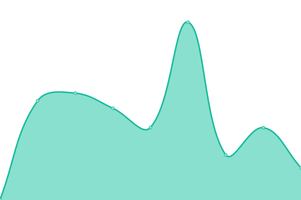

# [📈 Live Status](https://CaminoScan.github.io/camino-status): <!--live status--> **🟩 All systems operational**

This repository contains the open-source uptime monitor and status page for [CaminoScan](caminoscan.com), powered by [Upptime](https://github.com/upptime/upptime).

With [Upptime](https://upptime.js.org), you can get your own unlimited and free uptime monitor and status page, powered entirely by a GitHub repository. We use [Issues](https://github.com/CaminoScan/camino-status/issues) as incident reports, [Actions](https://github.com/CaminoScan/camino-status/actions) as uptime monitors, and [Pages](https://CaminoScan.github.io/camino-status) for the status page.

<!--start: status pages-->
<!-- This summary is generated by Upptime (https://github.com/upptime/upptime) -->
<!-- Do not edit this manually, your changes will be overwritten -->
<!-- prettier-ignore -->
| URL | Status | History | Response Time | Uptime |
| --- | ------ | ------- | ------------- | ------ |
|  [CaminoScan - Camino Mainnet](https://caminoscan.com) | 🟩 Up | [camino-scan-camino-mainnet.yml](https://github.com/CaminoScan/camino-status/commits/HEAD/history/camino-scan-camino-mainnet.yml) | 

 928ms
     
 | 

<a href="https://status.caminoscan.com/history/camino-scan-camino-mainnet">100.00%</a>
    

|  [CaminoScan - Columbus Testnet](https://columbus.caminoscan.com) | 🟩 Up | [camino-scan-columbus-testnet.yml](https://github.com/CaminoScan/camino-status/commits/HEAD/history/camino-scan-columbus-testnet.yml) | 

 897ms
     
 | 

<a href="https://status.caminoscan.com/history/camino-scan-columbus-testnet">100.00%</a>
    

|  [Camino Mainnet RPC Endpoint - Ping](api.camino.network) | 🟩 Up | [camino-mainnet-rpc-endpoint-ping.yml](https://github.com/CaminoScan/camino-status/commits/HEAD/history/camino-mainnet-rpc-endpoint-ping.yml) | 

 129ms
     
 | 

<a href="https://status.caminoscan.com/history/camino-mainnet-rpc-endpoint-ping">100.00%</a>
    

|  [Columbus Testnet RPC Endpoint - Ping](columbus.camino.network) | 🟩 Up | [columbus-testnet-rpc-endpoint-ping.yml](https://github.com/CaminoScan/camino-status/commits/HEAD/history/columbus-testnet-rpc-endpoint-ping.yml) | 

 128ms
     
 | 

<a href="https://status.caminoscan.com/history/columbus-testnet-rpc-endpoint-ping">100.00%</a>
    

|  [Camino Mainnet RPC Endpoint - POST](https://api.camino.network/ext/info) | 🟩 Up | [camino-mainnet-rpc-endpoint-post.yml](https://github.com/CaminoScan/camino-status/commits/HEAD/history/camino-mainnet-rpc-endpoint-post.yml) | 

 438ms
     
 | 

<a href="https://status.caminoscan.com/history/camino-mainnet-rpc-endpoint-post">100.00%</a>
    

|  [Columbus Testnet RPC Endpoint - POST](https://columbus.camino.network/ext/info) | 🟩 Up | [columbus-testnet-rpc-endpoint-post.yml](https://github.com/CaminoScan/camino-status/commits/HEAD/history/columbus-testnet-rpc-endpoint-post.yml) | 

 434ms
     
 | 

<a href="https://status.caminoscan.com/history/columbus-testnet-rpc-endpoint-post">100.00%</a>
    

|  [Camino Suite - Homepage](https://suite.camino.network/) | 🟩 Up | [camino-suite-homepage.yml](https://github.com/CaminoScan/camino-status/commits/HEAD/history/camino-suite-homepage.yml) | 

 513ms
     
 | 

<a href="https://status.caminoscan.com/history/camino-suite-homepage">100.00%</a>
    

|  [Camino Suite - Wallet](https://suite.camino.network/login) | 🟩 Up | [camino-suite-wallet.yml](https://github.com/CaminoScan/camino-status/commits/HEAD/history/camino-suite-wallet.yml) | 

 129ms
     
 | 

<a href="https://status.caminoscan.com/history/camino-suite-wallet">100.00%</a>
    

|  [Camino Suite - Explorer - Mainnet](https://suite.camino.network/explorer/camino/c-chain) | 🟩 Up | [camino-suite-explorer-mainnet.yml](https://github.com/CaminoScan/camino-status/commits/HEAD/history/camino-suite-explorer-mainnet.yml) | 

 130ms
     
 | 

<a href="https://status.caminoscan.com/history/camino-suite-explorer-mainnet">100.00%</a>
    

|  [Camino Suite - Explorer - Columbus Testnet](https://suite.camino.network/explorer/columbus/c-chain) | 🟩 Up | [camino-suite-explorer-columbus-testnet.yml](https://github.com/CaminoScan/camino-status/commits/HEAD/history/camino-suite-explorer-columbus-testnet.yml) | 

 130ms
     
 | 

<a href="https://status.caminoscan.com/history/camino-suite-explorer-columbus-testnet">100.00%</a>
    

|  [Camino Network Homepage](https://camino.network) | 🟩 Up | [camino-network-homepage.yml](https://github.com/CaminoScan/camino-status/commits/HEAD/history/camino-network-homepage.yml) | 

 322ms
     
 | 

<a href="https://status.caminoscan.com/history/camino-network-homepage">98.75%</a>
    

<!--end: status pages-->

[**Visit our status website →**](https://CaminoScan.github.io/camino-status)

## 📄 License

- Powered by: [Upptime](https://github.com/upptime/upptime)
- Code: [MIT](./LICENSE) © [Anand Chowdhary](https://anandchowdhary.com), supported by [Pabio](https://pabio.com)
- Data in the `./history` directory: [Open Database License](https://opendatacommons.org/licenses/odbl/1-0/)
